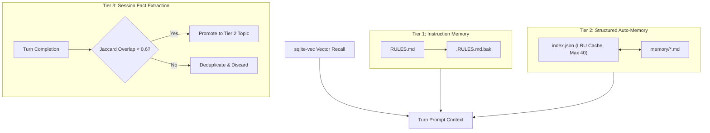

<div align="center">

# Maidere

**Autonomous, Privacy-First AI Agent & Cognitive Engine for Local Workstations & Cloud Clusters**

[](https://www.python.org/)
[](https://fastapi.tiangolo.com/)
[](https://langchain-ai.github.io/langgraph/)
[](https://ollama.com/)
[](https://build.nvidia.com/)
[](LICENSE)
[](tests/)

*Engineered for zero subscription costs, zero GPU model-thrashing, and enterprise-grade reasoning on consumer hardware (NVIDIA RTX 5060 8GB / 16GB RAM) with instant hybrid scaling to massive cloud models (Nemotron-3-Ultra 550B up to 128K context).*

[Quickstart](#quickstart-in-60-seconds) • [Architecture](#subsystem-architecture) • [Cognitive Modes](#cognitive-engine--operational-modes) • [Hybrid LLM & Cloud](#hybrid-inference--cloud-scaling) • [Memory Engine](#3-tier-memory-engine) • [Tools](#registered-agent-tools) • [Documentation](ARCHITECTURE.md)

</div>

---

## Highlights & Key Capabilities

- **Zero-VRAM CPU Embeddings**: High-performance semantic vector embeddings executed entirely on CPU via `fastembed` (`BAAI/bge-small-en-v1.5`), preserving 100% of GPU VRAM for LLM generation.
- **Native Desktop & Continuous Development App**: Runs as a lightweight native desktop application (`python3 maidere.py`) with OS dock integration, intelligent server lifecycle management, and a live hot-reloading development mode (`--dev`).
- **Dynamic 5-Tier Context Selector**: Real-time context window switcher scalable from **8K (Local Fast)** up to **128K (Cloud Extreme)** with automatic token trimming and context-aware KV cache management.
- **System 2 Deliberation Pipeline**: Multi-stage cognitive deconstruction, divergent exploration, formal proof verification, and convergent synthesis with real-time `<think>...</think>` streaming.
- **Hybrid Local + Cloud Execution**: Auto-routes between local Ollama instances (`qwen2.5:7b-instruct`, `qwen2.5:3b`, `deepseek-r1:7b`) and cloud-accelerated endpoints (NVIDIA Nemotron 3 Ultra 550B, OpenAI-compatible APIs).
- **In-Process SQLite Vector Database**: ACID-compliant SQLite WAL mode with `sqlite-vec` extension (`vec0` virtual table), eliminating external vector database overhead.
- **3-Tier Self-Healing Memory**: Persistent hierarchical memory combining rule enforcement (`RULES.md`), structured topic auto-memory with LRU eviction (`memory/*.md`), and turn-level fact extraction with Jaccard novelty filtering.
- **Specialized Subagent Fleet**: Ephemeral subagents (`researcher`, `plan`, `verification`, `validation`, `reviewer`, `staffer`) communicating via a microsecond-stamped file artifact bus.
- **Local Metasearch & Sandboxed Tools**: Private metasearch via local SearXNG, ephemeral Playwright web scraper, safe subprocess execution, and bidirectional Obsidian vault synchronization.

---

## Quickstart in 60 Seconds

### 1. System Requirements
- **Workstation OS**: Linux Mint 21+, Ubuntu 22.04+, or modern Linux distribution.
- **Local GPU**: NVIDIA GPU with $\ge$ 8GB VRAM (e.g. RTX 5060, 4060, 3060).
- **System Memory**: 16 GB RAM.
- **Prerequisites**: Python 3.12 (`>=3.12, <3.14`), Docker & Docker Compose, Ollama, [uv](https://docs.astral.sh/uv/) (recommended).

### 2. Setup & Installation
```bash
# Clone the repository
git clone https://github.com/Khazar451/maidere.git
cd maidere

# Option A: Install using uv (recommended for sub-second installs)
uv sync

# Option B: Standard Python virtual environment
python3 -m venv .venv
source .venv/bin/activate
pip install -e .

# Start local Ollama & pull recommended models
ollama pull qwen2.5:7b-instruct
ollama pull qwen2.5:3b
ollama pull deepseek-r1:7b

# Launch background infrastructure (SearXNG metasearch, Prometheus, Grafana)
docker compose up -d
```

### 3. Launching Maidere

Maidere can be launched in three modes:

```bash
# 1. Native Desktop Application (Default)
python3 maidere.py

# 2. Continuous Development Mode (Live hot-reloading on file change)
python3 maidere.py --dev

# 3. Register Desktop App in OS Start Menu & App Launcher
python3 maidere.py install-desktop

# 4. Headless Server Mode (Browser UI at http://localhost:8000)
.venv/bin/uvicorn api.app:app --host 0.0.0.0 --port 8000
```

---

## Subsystem Architecture

```
┌────────────────────────────────────────────────────────────────────────────────────────┐
│                             HOST OS (Linux Mint / Ubuntu)                              │
├─────────────────────────────────────────┬──────────────────────────────────────────────┤
│           LOCAL GPU VRAM (8.0 GB)       │             SYSTEM RAM (16.0 GB)             │
│ ┌─────────────────────────────────────┐ │ ┌──────────────────────────────────────────┐ │
│ │ Ollama Daemon                       │ │ │ Native Desktop & FastAPI Server          │ │
│ │  - Primary: qwen2.5:7b-instruct     │ │ │  - Window Manager & Process Lifecycle    │ │
│ │    (Pinned Q4_K_M: ~4.7 GB)         │ │ │  - WebSocket Token & Event Stream        │ │
│ │  - Reasoning: deepseek-r1:7b        │ │ │  - Tri-Model Dynamic Intent Router       │ │
│ │    (Proof verification: ~4.7 GB)    │ │ │  - Prometheus Instrumentator (/metrics)  │ │
│ │  - Fast: qwen2.5:3b (on-demand)     │ │ ├──────────────────────────────────────────┤ │
│ │  - Dynamic KV Cache (8K/16K/32K)    │ │ │ LangGraph Agent Core                     │ │
│ │  - CUDA Driver Buffers (~1.5 GB)    │ │ │  - Cyclic: trim -> remember -> think ->  │ │
│ └─────────────────────────────────────┘ │ │    act -> evaluate -> verify -> converge │ │
├─────────────────────────────────────────┤ │  - Isolated Subagent Contexts            │ │
│         CLOUD INFERENCE BRIDGE          │ │  - File-Based Artifact Bus (.maidere/)   │ │
│ ┌─────────────────────────────────────┐ │ ├──────────────────────────────────────────┤ │
│ │ NVIDIA NIM / OpenAI Cloud Endpoints │ │ │ In-Process CPU & Storage Subsystems      │ │
│ │  - nvidia/nemotron-3-ultra-550b     │ │ │  - FastEmbed (bge-small-en-v1.5 on CPU)  │ │
│ │  - Context: 64K Massive / 128K Extr │ │ │  - SQLite Database (WAL Mode Enabled)    │ │
│ │  - Thinking Mode & Reasoning Delta  │ │ │    * sqlite-vec (vec0 Virtual Table)     │ │
│ └─────────────────────────────────────┘ │ │    * LangGraph Checkpoints & Audit Log   │ │
│                                         │ │    * Persistent APScheduler Job Store    │ │
│                                         │ ├──────────────────────────────────────────┤ │
│                                         │ │ Docker Bridge Services                   │ │
│                                         │ │  - SearXNG Metasearch (Port 8080)        │ │
│                                         │ │  - Prometheus TSDB (Port 9090)           │ │
│                                         │ │  - Grafana Telemetry (Port 3000)         │ │
│                                         │ └──────────────────────────────────────────┘ │
└─────────────────────────────────────────┴──────────────────────────────────────────────┘
```

---

## Cognitive Engine & Operational Modes

Maidere provides three cognitive paradigms selectable from the top navigation bar or bottom input deck:

| Mode | Selector | Execution Pipeline & Behavior |
| :--- | :--- | :--- |
| **Auto** *(Default)* | `Auto` | **Dynamic Complexity Routing**: Classifies task complexity (`SIMPLE` &rarr; `qwen2.5:3b`, `COMPLEX` &rarr; `qwen2.5:7b-instruct`, `REASONING` &rarr; `deepseek-r1:7b`) with sub-millisecond intent evaluation. |
| **Thinking** | `Thinking` | **Single-Pass Chain-of-Thought**: Generates step-by-step reasoning inside `<think>...</think>` scratchpad tags with real-time token streaming and collapsible UI accordions. |
| **Deep Reason** | `Deep Reason` | **Multi-Stage System 2 Deliberation**: Exhaustive 3-phase cognitive framework:<br>1. *Divergent Exploration*: Problem deconstruction, alternative hypotheses, falsification stress-testing.<br>2. *Analytical Verification*: Independent recalculation of math, state mutations, and citation integrity.<br>3. *Convergent Synthesis*: Formal synthesis with fourth-wall reviewer leakage prevention. |

---

## Dynamic Context Window Selector

Maidere allows users to tune the context window size on the fly via the top bar `CTX:` selector:

| Context Tier | Tokens (`num_ctx`) | Target Engine | KV Cache Impact | Best For |
| :--- | :--- | :--- | :--- | :--- |
| **8K - Medium** | `8192` | Local Ollama | ~0.46 GB | High-speed chit-chat & lightweight scripts |
| **16K - High** *(Default)* | `16384` | Local Ollama | ~0.92 GB | **Balanced standard**; 2.4 GB VRAM headroom |
| **32K - Ultra** | `32768` | Local Ollama | ~1.84 GB | Deep multi-turn conversations & complex code |
| **64K - Cloud Massive** | `65536` | NVIDIA Nemotron | Offloaded | Enterprise refactoring & massive documentation |
| **128K - Cloud Extreme** | `131072` | NVIDIA Nemotron | Offloaded | Full repository analysis & extensive research |

*Selecting a cloud model automatically promotes the context window to 64K, and switches back safely when returning to local models.*

---

## Hybrid Inference & Cloud Scaling

Configure cloud acceleration in `.env` to unlock models like **NVIDIA Nemotron 3 Ultra 550B**:

```ini
# NVIDIA NIM / OpenAI-Compatible Cloud Endpoint
CLOUD_API_BASE=https://integrate.api.nvidia.com/v1
CLOUD_API_KEY=nvapi-your-key-here
CLOUD_MODEL=nvidia/nemotron-3-ultra-550b-a55b
CLOUD_NUM_CTX=65536
```

- **Native Thinking Protocol**: Automatically sends `extra_body={"chat_template_kwargs": {"enable_thinking": True}}` and streams `delta.reasoning_content` in real time.
- **Fail-Safe Fallback**: If the cloud API is unreachable or rate-limited, Maidere falls back gracefully to local Ollama models.

---

## 3-Tier Memory Engine



1. **Tier 1 (Instruction Memory)**: Manages `.maidere/RULES.md` with automatic `.bak` backups created prior to file mutation for one-step rollback.
2. **Tier 2 (Structured Auto-Memory)**: Topic markdown files (`.maidere/memory/*.md`) indexed via `index.json`, enforcing the Two-Step Save Invariant, LRU eviction capped at 40 indexed entries, and startup reconciliation.
3. **Tier 3 (Session Fact Extraction)**: Extracts user preferences, architectural rules, and project decisions upon turn completion, verifies novelty with Jaccard word-overlap scoring, and auto-promotes unique facts to Tier 2.

---

## Registered Agent Tools

| Tool | Purpose | Signature |
| :--- | :--- | :--- |
| `read_file` | Read workspace file contents with path confinement | `path: str` |
| `write_file` | Atomic file write with automatic directory creation | `path: str, content: str` |
| `list_dir` | List files and directories within the sandbox | `path: str` |
| `shell` | Run allowlisted shell command with `shell=False` | `command: str` |
| `code_runner` | Execute sandboxed Python script inside workspace | `code: str` |
| `browser` | Scrape webpage DOM text via ephemeral Playwright | `url: str` |
| `delegate_task` | Spawn isolated subagents (`researcher`, `plan`, `verification`, `validation`, `reviewer`, `staffer`) | `prompt: str, subagent_type: str, max_turns: int` |
| `manage_memory`| 3-Tier memory manager (read/save topic facts, view rules) | `action: str, topic: str, content: str` |
| `agy_staffer` | External Gemini 3.8 Flash delegate via Antigravity CLI | `prompt: str, persona: str` |
| `obsidian` | Bi-directional Obsidian note search, read, write, and open | `action: str, note_name: str, content: str` |
| `scheduler` | Schedule persistent cron jobs via SQLite APScheduler | `action: str, job_id: str, ...` |
| `web_search` | Private local metasearch via SearXNG | `query: str` |
| `list_available_skills` | Discover installed specialized skills | `{}` |
| `load_skill` | Load executable instructions for a skill | `skill_name: str` |

---

## Automated Verification Suite

Maidere maintains an exhaustive automated test suite with **245 tests across 23 modules**:

```bash
# Execute full test suite
HF_HUB_OFFLINE=1 .venv/bin/python -m unittest discover -s tests -p "test_*.py" -v
```

```text
Ran 245 tests in 4.808s — OK (100% Passed, 0 Failures, 0 Errors)
```

| Test Module | Coverage Area | Status |
| :--- | :--- | :---: |
| `test_agent.py` | LangGraph cyclic execution, message trimming, tool loops | **PASS** |
| `test_cloud_llm.py` | NVIDIA NIM & OpenAI cloud client, Nemotron thinking stream | **PASS** |
| `test_desktop_launcher.py`| Desktop lifecycle, port probing, signal handling, XDG launcher | **PASS** |
| `test_memory_tiers.py` | Tier 1 RULES.md backups, Tier 2 LRU auto-memory, Tier 3 Jaccard filter | **PASS** |
| `test_subagent.py` | Ephemeral subagent isolation, handoff briefs, tool restrictions | **PASS** |
| `test_router.py` | Tri-model intent classifier, reasoning detection, overrides | **PASS** |
| `test_synthesis_hardening.py` | Inline citation bracket normalization, fourth-wall leak filtering | **PASS** |
| `test_tools.py` | Path traversal prevention, shell allowlist, safe argument parsing | **PASS** |
| `test_obsidian.py` | Obsidian vault resolution, frontmatter formatting, note search | **PASS** |
| `test_monitoring.py` | Prometheus metrics exposition, latency histograms, token counters | **PASS** |
| `test_phase4.py` | Python code runner, Playwright browser cleanup, APScheduler crons | **PASS** |
| `test_web_ui.py` | Static serving, WebSocket protocol, theme settings, thread persistence | **PASS** |

---

## Documentation

- **[ARCHITECTURE.md](ARCHITECTURE.md)**: Exhaustive technical specification, hardware budget allocation matrix, security controls, and design patterns.
- **[CONTRIBUTING.md](CONTRIBUTING.md)**: Guidelines for extending tools, adding skills, and running benchmarks.

---

## License

MIT License — Free for personal, academic, and commercial use.
